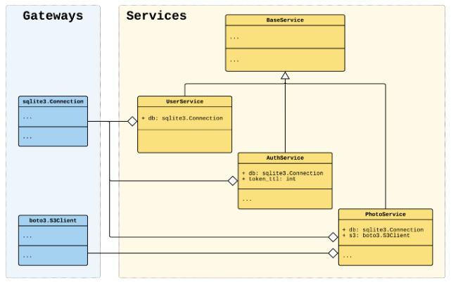

# Application example (single container)

This example shows how you can create an application using a single declarative container. Using a single declarative container is a good choice for small or moderate size application. For building a large application refer to Application example (multiple containers).

We build an example micro application following the dependency injection principle. It consists of several services with a domain logic. The services have dependencies on database & AWS S3.



## Getting started

Make sure that the venv is activated, pip is updated, packages are installed and cd into ets-labs/single_container within the venv.

## Running main
`python -m single_container user@example.com secret photo.jpg`

This should return:

```
[DEBUG] [single_container.services.UserService]: User user@example.com has been found in database
[2022-12-21 15:59:22,162] [DEBUG] [single_container.services.AuthService]: User user@example.com has been successfully authenticated
[2022-12-21 15:59:22,162] [DEBUG] [single_container.services.PhotoService]: Photo photo.jpg has been successfully uploaded by user user@example.com
```


## Running tests
`pytest movies/tests.py --cov=movies`